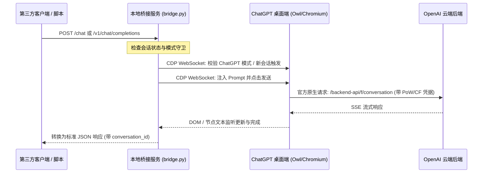

# ChatGPT Desktop Bridge

> 将官方 ChatGPT 桌面端（Windows / macOS）通过 Chrome DevTools Protocol (CDP) 桥接为标准 OpenAI 兼容接口 (`/v1/chat/completions`) 与极简 `/chat` 接口。

[](LICENSE)
[](https://www.python.org/)

---

## 🌟 核心特性

- **🛡️ 零风控风险与原生防爬复用**：完全运行在官方原生桌面端内部，**天然复用官方所有的 Cloudflare 验证、Sentinel 工作量证明 (PoW) 与浏览器原生 TLS 指纹**，无需逆向破解防护算法，杜绝封号。
- **🔍 智能安装路径探测**：
  - 自动识别 Windows MSIX 应用商店包（`OpenAI.Codex`）与标准 Win32 目录。
  - 自动识别 macOS 应用程序目录（`/Applications/ChatGPT.app`）。
  - 支持通过命令行参数 `--chatgpt-path` 或环境变量 `CHATGPT_PATH` 自定义路径。
- **🛡️ 模式守卫 (Auto Mode Guard)**：针对官方客户端合并了 Codex (Work) 与 ChatGPT (Chat) 的双模架构，脚本在每次发消息前自动检测并锁定为标准 **ChatGPT 聊天模式**，防止误入代码沙盒模式。
- **💬 会话管理与上下文控制**：
  - **不传 / 传 `null`**：自动触发客户端“新对话”，开辟崭新会话，防止上下文无限污染。
  - **传入 `conversation_id`**：自动在当前会话中接续提问，保持多轮记忆。
- **🔌 双协议全面兼容**：
  - 标准 OpenAI 格式：`POST /v1/chat/completions`（无缝对接 NextChat、Chatbox、Cursor、沉浸式翻译等生态）。
  - 极简格式：`POST /chat`（`{"prompt": "...", "conversation_id": "..."}`）。

---

## 📐 架构设计



---

## 🚀 快速上手

### 1. 安装依赖

本项目仅需安装轻量依赖 `websockets`：

```bash
pip install -r requirements.txt
```

### 2. 启动服务

直接运行一键脚本（自动检测、重启 ChatGPT 客户端并开启调试端口）：

- **Windows CMD**：
  ```cmd
  start.bat
  ```
- **Windows PowerShell**：
  ```powershell
  .\start.ps1
  ```
- **跨平台 Python 命令行**：
  ```bash
  python bridge.py
  ```

启动成功后，控制台将显示：
```text
==================================================================
  ChatGPT Desktop Bridge is RUNNING on http://127.0.0.1:18080
  Chat Endpoint:     http://127.0.0.1:18080/chat
  OpenAI Endpoint:   http://127.0.0.1:18080/v1/chat/completions
  Models Endpoint:   http://127.0.0.1:18080/v1/models
  Health Check:      http://127.0.0.1:18080/health
==================================================================
```

---

## ⚙️ 路径配置与启动参数

脚本会按以下优先级自动探测 ChatGPT 桌面端路径：
1. 命令行参数 `--chatgpt-path`
2. 环境变量 `CHATGPT_PATH`
3. 操作系统常用安装路径（包括 WindowsApps MSIX 目录与 Program Files）

#### 自定义启动示例：

```bash
# 指定自定义安装路径
python bridge.py --chatgpt-path "D:\Tools\ChatGPT\ChatGPT.exe"

# 指定服务端口
python bridge.py --port 18080 --cdp-port 9223

# 已自行手动打开带调试端口的客户端，仅启动桥接层
python bridge.py --no-launch
```

---

## 📡 接口调用指南

### 1. `/chat` 极简会话接口

#### 请求示例（新对话）：
```bash
curl -X POST http://127.0.0.1:18080/chat \
  -H "Content-Type: application/json" \
  -d '{"prompt": "我最喜欢的颜色是深蓝色，请记住。"}'
```

#### 响应示例：
```json
{
  "conversation_id": "01a0dee3-410b-7140-96f3-bd9a561af9f5",
  "response": "记住啦，你最喜欢的颜色是深蓝色。",
  "choices": [
    {
      "message": {
        "role": "assistant",
        "content": "记住啦，你最喜欢的颜色是深蓝色。"
      }
    }
  ]
}
```

#### 请求示例（带 `conversation_id` 接续对话）：
```bash
curl -X POST http://127.0.0.1:18080/chat \
  -H "Content-Type: application/json" \
  -d '{
    "prompt": "我刚才说我最喜欢的颜色是什么？",
    "conversation_id": "01a0dee3-410b-7140-96f3-bd9a561af9f5"
  }'
```

---

### 2. `/v1/chat/completions` (OpenAI 标准兼容)

支持任意支持 OpenAI API 标准的工具无缝对接：

- **API Base URL**：`http://127.0.0.1:18080/v1`
- **API Key**：可随意填写（如 `sk-local`）
- **Model**：`chatgpt-desktop` 或 `gpt-6-sol`

```python
from openai import OpenAI

client = OpenAI(
    base_url="http://127.0.0.1:18080/v1",
    api_key="sk-local"
)

response = client.chat.completions.create(
    model="chatgpt-desktop",
    messages=[
        {"role": "user", "content": "你好，请解释一下量子计算的基本概念"}
    ]
)

print(response.choices[0].message.content)
```

---

## ⚠️ 免责声明 (Disclaimer)

本项目仅供个人开发者本地学习、研究自动化调试协议与本地应用集成之用。请遵守 OpenAI 相关服务条款。本工具不绕过任何官方付费校验与登录鉴权，所有数据流转均基于用户本地运行的官方客户端。
